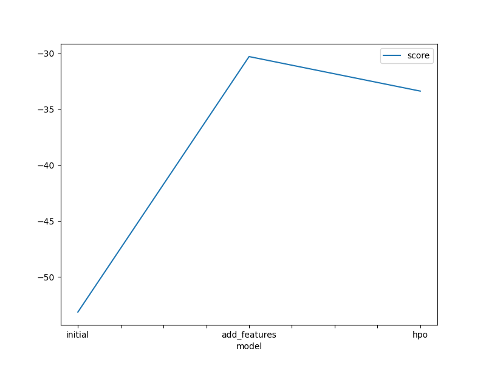
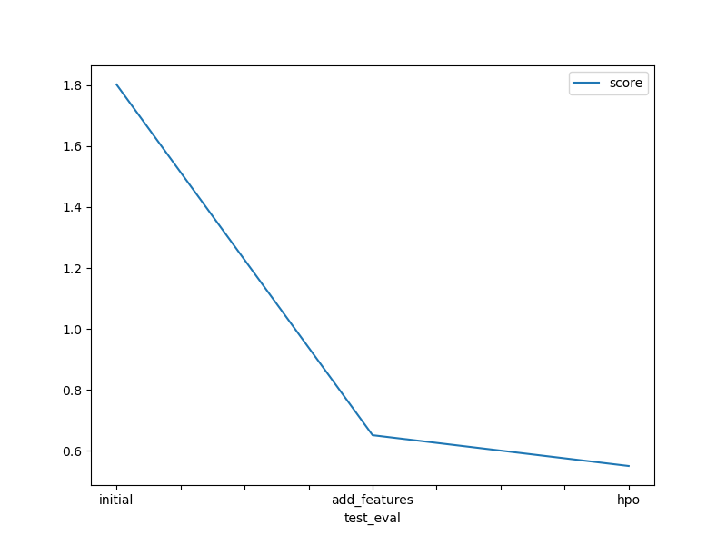

# Report: Predict Bike Sharing Demand with AutoGluon Solution
#### Daniel Mathews

## Initial Training
### What did you realize when you tried to submit your predictions? What changes were needed to the output of the predictor to submit your results?
If the predictions weren't very good, some of the count values would be negative which is not allowed when submitting predictions and doesn't make sense realistically. Setting all negative count values equal to 0 fixed this problem and probably helped the score a little bit since 0 would be closer to the actual value than a negative count.

### What was the top ranked model that performed?
The top ranked model when doing the initial traing was WeightedEnsemble_L3. This makes sense because it takes the predictions from the second-level models (like WeightedEnsemble_L2) and combines them, typically using a weighted averaging approach, to produce the final predictions. This multi-layer approach helps in leveraging the strengths of different models and improving the overall predictive performance of the system by reducing overfitting and improving generalization. This was identified by making use of the fit_summary() function in the autogluon package to determine the performance of the 12 different models that were trained. The WeightedEnsemble_L3 was found to have the lowest root mean squared error, resulting in the best predictions.

## Exploratory data analysis and feature creation
### What did the exploratory analysis find and how did you add additional features?
The exploratory analysis found a number of things. First, noticing that most of the data types of the data fields were integers, this would not perform well when training the model and creating predictions. This is where modifying and adding features came into play. I split the datetime column out into month, day, and hour, such that we would have more parameters to train the model on that provides valuable information by making it more granular. Also, modifying the integer columns into categorial columns, based on the problem statement, for weather and season, made it so the model would understand better the different categories. All this is doing is extracting useful features from the data that is already there so the model can train and predict more accurately. 

### How much better did your model preform after adding additional features and why do you think that is?
Adding additional features to a model often leads to an improvement in performance, primarily due to the increased amount of information and context those features provide to the model. Additional features can introduce new, relevant information that was not captured by the initial set of features. This can help the model to make more informed predictions. A model trained with limited features might develop biases based on the narrow dataset it was trained on. By adding more diverse and comprehensive features, these biases can be reduced as the model starts considering a wider range of factors.

The model performed 63.87% better than the previous model, reducing the score from 1.80255 to 0.65116.  

## Hyper parameter tuning
### How much better did your model preform after trying different hyper parameters?
By adding in hyper paremeters, the model performed better than just using the default parameters and adding features like in the first two attempts. The model with hyperparameters performed 15.5% better than the previous model that used feature creation.

### If you were given more time with this dataset, where do you think you would spend more time?
I would spend more time training the model with the given dataset and potentially adding more datasets. Training it for only 5 minutes and using 1 set of data may not produce the best results that you can get. And the model may need more time to explore better solutions. I could also explore more the hyperparameter options to determine what factors lead to better predictions. Also speding more time to tune the hyperparameter optimizations would lead to better scores.

### Create a table with the models you ran, the hyperparameters modified, and the kaggle score.
|model|hpo1|hpo2|hpo3|score|
|--|--|--|--|--|
|initial|prescribed_values|prescribed_values|"presets: 'best_quality'"|1.80255|
|add_features|prescribed_values|prescribed_values|"presets: 'best_quality'"|0.65116|
|hpo|Tree-Based Models: (GBM, XT, XGB, & RF)|KNN|"presets: 'best_quality"|0.55005|

### Create a line plot showing the top model score for the three (or more) training runs during the project.

### Create a line plot showing the top kaggle score for the three (or more) prediction submissions during the project.

## Summary
Performing EDA enhances results and allows you to find useful insights about the data. The models also perform better after some pre-processing of the data and re-organization. The Autogluon library allows you to easily create these models and predict tabular results. Spending time to tune the models using hyperparameter optimization leads to better performance.
